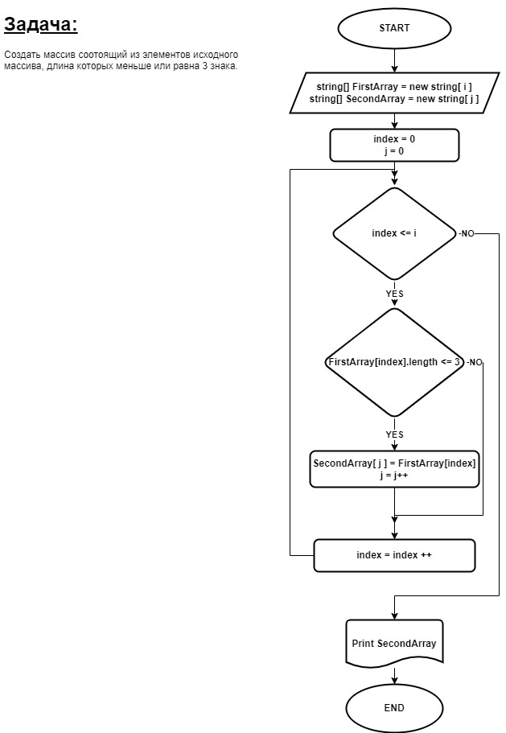

# **ИТОГОВАЯ ПРОВЕРОЧНАЯ РАБОТА по блоку "Выбор Специализации"**
_**Задача:**_
- **Написать программу, которая из имеющегося массива строк формирует новый массив из строк, длина которых меньше, либо равна 3 символам. Первоначальный массив вводится с клавиатуры.**

_**Примеры**:_
- [“Hello”, “2”, “world”, “:-)”] → [“2”, “:-)”]
[“1234”, “1567”, “-2”, “computer science”] → [“-2”]
[“Russia”, “Denmark”, “Kazan”] → []

_**Решение**:_ 

1. Блок-схема алгоритма решения 
2. Пользователь вводит элементы массива разделяя их запятой и пробелом.
3. Введённая строка разбивается на массив с отдельными элементами.
4. Вызываем метод "NewArray", в котором перебираем все элементы заданного пользователем массива, элементы удовлетворяющие нашему условию _*(меньше или равно 3 символам)*_ записываем в новый массив.
5. Выводим массив в консоль.

## Спасибо за внимание!